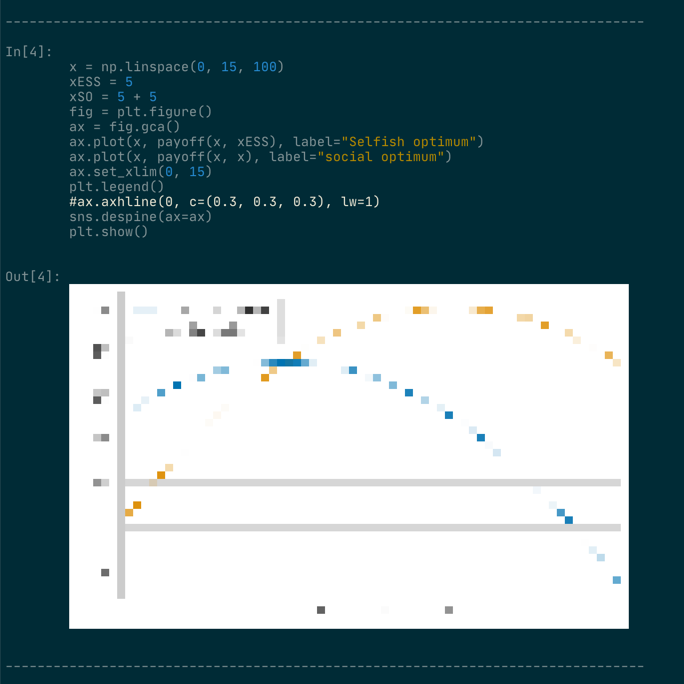

# ipynbviewer

`ipynbviewer` is a script that outputs Jupyter Notebook in the terminal in a human readable format. It is particularly useful when you want to skim through your notebooks on ssh without having to start a jupyter notebook instance.

It highlights syntax, shows outputs and previews images (in very low resolution). It is heavily customisable, you can easily add a new parser for different sources of code or output.

For now, `ipynbviewer` only supports python, markdown, text output, html outputs and images for ipynb v4.

Feel free to contribute by creating issues and pull requests.

## Screenshot



## Installation

```bash
pip install ipynbviewer  # does not work yet, ipynb hasn't been submitted to pypi
```

## Usage

```bash
ipynbviewer my_nb.ipynb  # output everything like cat

ipynbviewer my_nb.ipynb | less -r # output your notebook in a paginated viewer (here less)
```
